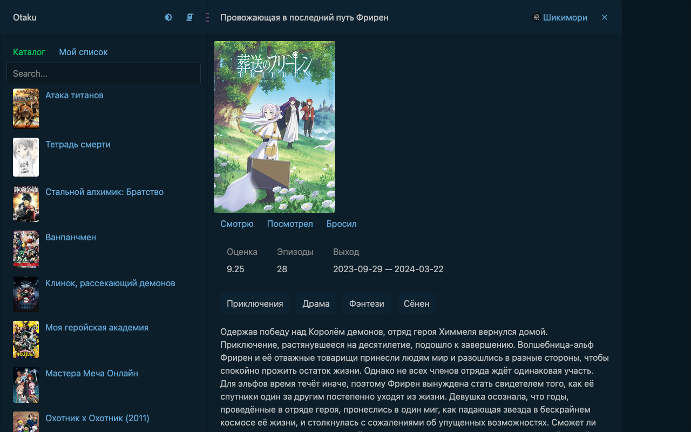

# Otaku

Каталог аниме на $mol поверх открытого API [Шикимори](https://shikimori.io/api/doc). Слева популярное и поиск по русскому и английскому названию, справа страница тайтла. Тайтл можно отметить «смотрю», «посмотрел» или «бросил», отметки лежат в браузере и собираются в «Мой список».

Живая версия: https://b-on-g.github.io/otaku/



## Устройство

- `domain/` — адрес API и схемы ответов на `$mol_schema`
- `anime` — `$otaku_anime`: страница тайтла, сама грузит карточку
- `app` — `$otaku_app`: каталог на `$mol_book2_catalog`, поиск и режим «Мой список» живут в адресе, статусы в `$mol_state_local`

## Запуск

Репозиторий клонируется внутрь [MAM](https://github.com/hyoo-ru/mam) рядом с `mol/`:

```bash
git clone https://github.com/hyoo-ru/mam.git && cd mam
git clone https://github.com/b-on-g/otaku.git
npm install && npm start
```

Приложение: http://localhost:9080/otaku/app/-/index.html

Тесты: `node otaku/app/-/node.test.js`, в браузере отчёт одной строкой в консоли `http://localhost:9080/otaku/app/-/test.html`.

## Что дальше

- Подгрузка следующих 50 тайтлов при прокрутке меню, API отдаёт страницы через `page=`.
- Фильтр по жанру и типу (сериал, фильм, OVA) рядом с поиском.
- Интерфейс на английском через `@ \Текст` и русский перевод в `app.locale=ru.json`.
